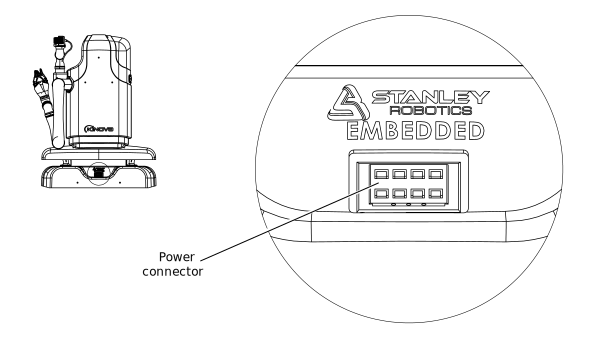

# MOVO charging port

This section describes the charging port used to connect MOVO to its power supply and the indicators that display the charging state.

The charging port for MOVO is on the left side of the base of MOVO. Here you can plug in the 8-pronged charging plug coming from the power supply.

The charging state is displayed on the other side of the MOVO base through LED indicators.

**Parent topic:** [MOVO hardware overview](../Concepts/c_movo_hardware_overview.md)

