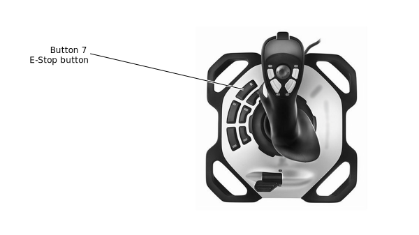

# E-Stop

This section describes the use of the E-Stop. The E-Stop lets you stop MOVO quickly in an emergency.

The E-Stop is a built-in safety feature of MOVO.

The E-stop is a red button on the human-machine interface \(HMI\) panel on the back of MOVO. Pressing in the E-Stop button shuts down MOVO. This allows a quick shut down in the case of an emergency.

When using remote tele-operation with the joystick using the default key mapping, the E-stop can also be triggered using button \#7 on the joystick.

**Note:** There is no brake on the wheels of MOVO. If MOVO is on a slope, while there will no longer be power applied to drive the wheel, there will also not be any active servoing on the wheels, so MOVO will tend to roll.

**Note:** There are no brakes in the JACO arms. When the power is cut, the arms will fall. Put your own arms under the JACO arms to cradle them as they fall, to prevent the arms from colliding with the skin of MOVO, or the ground.

**Note:** When MOVO starts up again, the arms will move to the homing position. So whenever you cut the power, move the arms manually so that they will not collide with other on powering up.

**Note:** Before starting up again, you will need to disarm the E-stop. Twist the E-Stop button clockwise as indicated on the button until it pops out again.

**Parent topic:** [Personal safety and security of MOVO](../Concepts/c_movo_safety.md)

