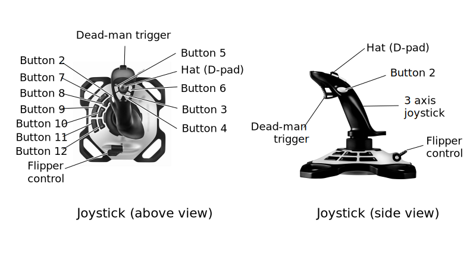

# Joystick control

This section describes the joystick used for remote tele-operation of MOVO and the control mapping for the joystick.

MOVO can be controlled wirelessly using the included Logitech Extreme 3D Pro joystick.

This joystick features:

-   3 axis joystick \(forward/backward, left/right, and twist clockwise/counterclockwise\)
-   Trigger \("Dead-man"\)
-   D-Pad / "Hat" control on top of joystick
-   5 buttons on the joystick \(\#2 on the side and 4 on the top - \#s 3 - 6\)
-   Flipper paddle on the base
-   6 buttons on the base \(\#s 7 - 12\)

The buttons are labeled on the joystick \#s 2 through 12.

There are four control modes:

1.  Active base control \(for horizontal movement\)
2.  Active torso control \(to raise / lower the upper torso\)
3.  Active head control \(pan / tilt control for the Kinect sensor\)
4.  Active arm and gripper control

The following diagram describes how to control MOVO with the joystick in each of the four modes of operation.

**Parent topic:** [MOVO hardware overview](../Concepts/c_movo_hardware_overview.md)

