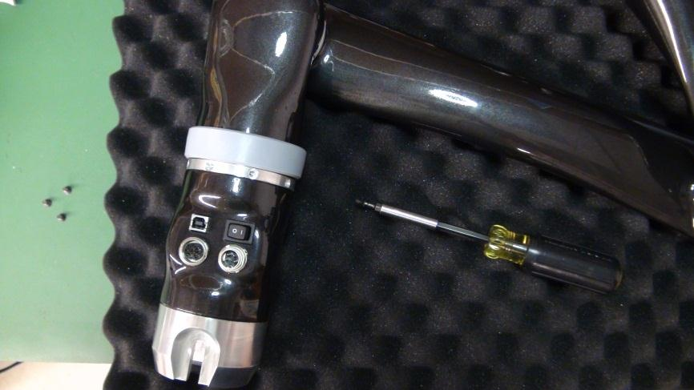
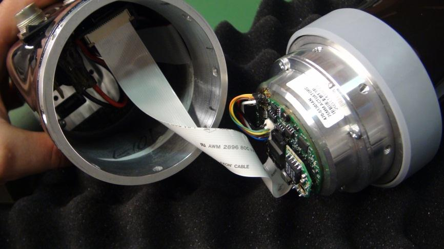

# Disconnect JACO arm from standard controller base

This page describes how to disconnect a JACO arm from a standard JACO controller base. This is necessary to prepare an arm to be mounted on MOVO.

-   Power down the JACO arm.
-   Disconnect any power, controller, and USB cables from the JACO arm.
-   Remove the arm from the table top mounting post and lay the arm down on a table.

Some of our MOVO customers already have their own JACO arms and have purchased MOVO without JACO arms attached. In this case, it is necessary to disconnect the JACO arm from the JACO controller base at the bottom of the arm so as to be able to remount the arm on the MOVO mounting base.

1.   Remove the plastic ring around the first actuator to expose the aluminum rings oin either side of the actuator.  
2.   Use a 2.5 mm hex key to remove the screws on the lower aluminum ring. 
3.   Gently pull apart the two aluminum rings, being careful not to damage the flex cable joining the controller base to the actuator.  
4.   Disconnect the flex cable from the actuator. 

You can now proceed to install the Kinova arm on MOVO.

**Parent topic:** [Working with JACO arms and MOVO](../Concepts/c_working_jaco_arms_movo.md)

