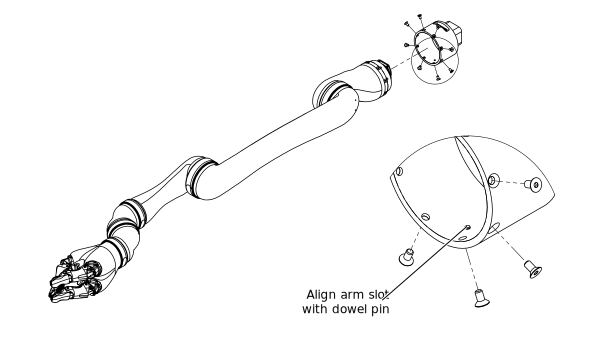

# Installing Kinova arms on MOVO

This section describes the process of installing Kinova arms on MOVO. This applies whether you are putting the arms on for the first time, or if you are putting the arms back on after removing them.

-   MOVO must be powered down.
-   You will need to have removed the upper front skin panel from MOVO. You need this to be removed to get access to the location of the mounting base. This skin panel is clipped on at the top; you don't need tools to remove it.
-   The mounting base used must have been removed from MOVO. You need this off MOVO to be able to attach all the screws to connect the arm to the base.
-   If the arm was previously mounted on a standard JACO controller base, you will need to have disconnected the arm at the first actuator from the base.
-   You will need a 2.5 mm hex key and a 5 mm hex key.

This procedure is used to connect \(or re-connect\) the arms to MOVO. This procedure will describe how to attach one arm. The procedure to attach a second arm is identical.

**Note:** You should try to minimize the frequency of taking off and putting on the arms. The flex cable linking the arm to the base is somewhat delicate and is only designed for a limited number of connections and disconnections. This is one reason we provide spare flex cables with our JACO arms

1.   Bring the arm close to its corresponding mounting base and re-connect the end of the flex cable sticking out of the base to the flex cable connector on the first actuator of the arm. Push down the tabs on the side of the flex cable connector to lock the cable in place. 

    **Note:** Make sure to connect the flex cable to the arm in the right orientation. Looking at the top of the actuator from above, the metallic side of the flex cable should be facing up rather than the blue side.

2.   Carefully bring the arm together with the base, being careful not to pinch the flex cable. Also, try your best not to twist the flex cable. 

    **Note:** Make sure to line up the dowel pin in the base housing with the slot on the outside of the first actuator.

      

3.   Re-insert and tighten the screws using a 2.5 mm hex key to connect the base to the actuator. 
4.   Slide the dummy base, with the arm attached, onto the mounting position on MOVO. Make sure to attach the correct arm on the correct side. 

    **Note:** Ensure that the base is the right side up. The power/controls connector port on the outside of the base must be facing upwards.

      

5.   Re-insert the screw on the top of the base to attach the base to MOVO. Tighten with a 5 mm hex key. 
6.   Plug in the connector to restore power and control connection between MOVO and the arm. 

After completing this procedure, the arm will be mounted on MOVO and connected for power and controls.

-   Repeat for the other arm as needed.
-   For MOVO's left arm, rotate the arm 180 degrees around the first actuator. When you are done, the output sides of the second actuator \(shoulder\) for both arms should face inwards. \(The two arms will make a mirror image\)

    **Note:** You have to do this before starting up, or it will not work properly on startup.

-   Reattach the previously removed upper front skin panel.
-   Position the arms in front of MOVO so that they hang straight down and are not intertwined. This will prevent the arms from colliding when moving to the home position on start-up.

**Parent topic:** [Working with JACO arms and MOVO](../Concepts/c_working_jaco_arms_movo.md)

