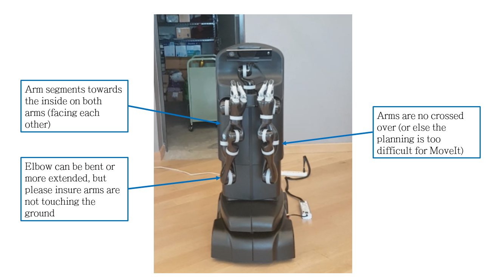

# Powering up MOVO

This section describes the procedure for powering up MOVO. This is carried out every time you turn MOVO on.

-   You should start MOVO on a flat surface.
-   If the E-Stop has previously been engaged, you need to disengage the E-Stop before starting up by twisting the E-Stop to the right until the button pops out.

    **Note:** As a safety precaution, the E-Stop will have been engaged before shipping. Make sure to disengage the E-Stop before your first power up after unboxing and charging MOVO.

1.   The arms stay flexible when not powered. They become stiff a few seconds after boot up. To avoid damaging the arms or the fingers, please pay attention to the following aspects. If required, please position the arms manually prior to powering up Movo. 

    **Note:** During the startup process, the arms will both rise up into the homing position. The arms will use MoveIt for planning their trajectory to the home position, but it may happen that the planning in MoveIt fails or leads to inadequate planning and eventually collision. To avoid those situations, please position the arms manually before boot up taking into account the criteria mentionned above. 

2.   Press the power button on the HMI panel on the rear upper torso of MOVO. This will initiate the internal startup processes for MOVO, as described in more detail elsewhere. A ring around the power button should flash blue, and the status LED will flash, first yellow, and then alternating yellow and green.  
3.   As the arms begin to rise to the homing position, supervise to ensure the arms do not collide. 

After completing this procedure, MOVO will be powered on.

-   **[MOVO boot-up process](../Concepts/c_movo_bootup_process.md)**  
This section describes the internal bootup process that takes place when MOVO is powered on.
-   **[Upstart process](../Concepts/c_movo_upstart_process.md)**  
This section describes the upstart process that is launched by the boot-up process on powering up MOVO.

