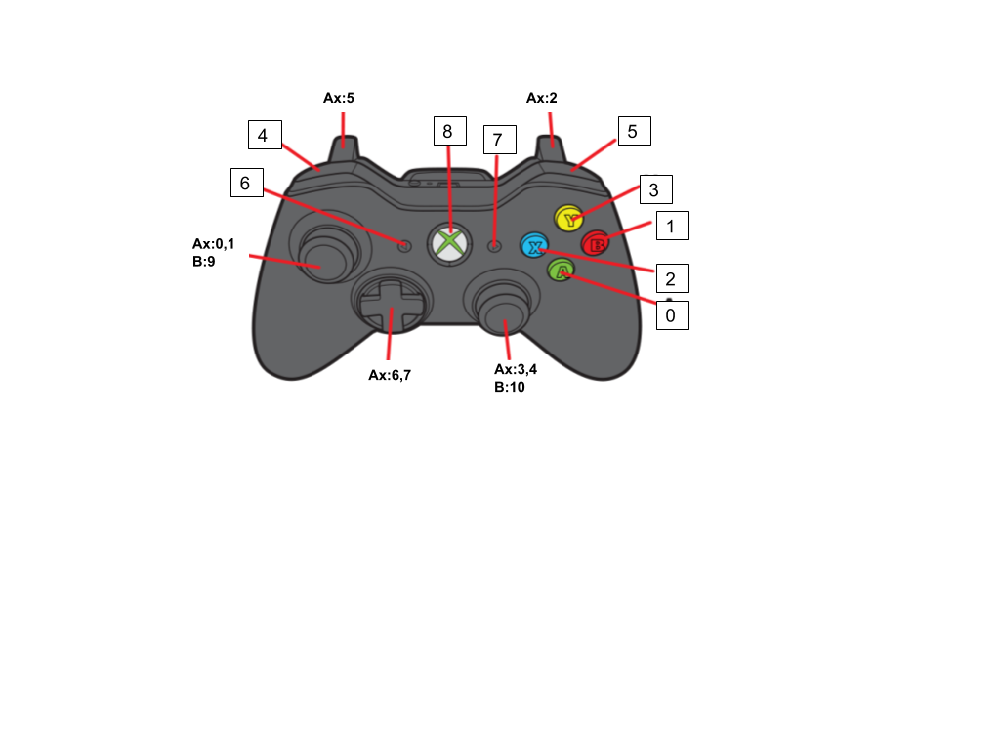
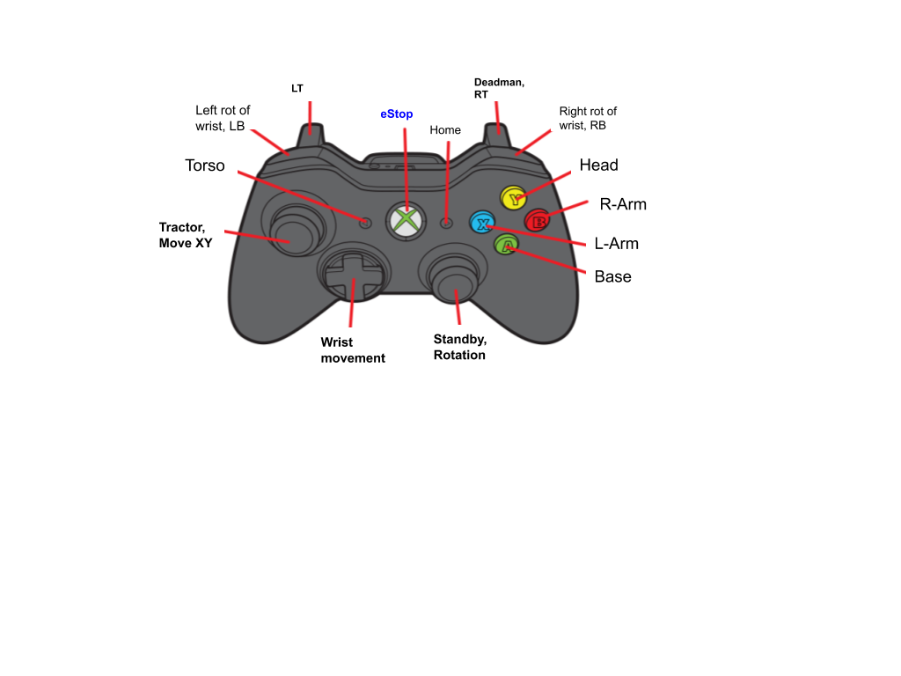
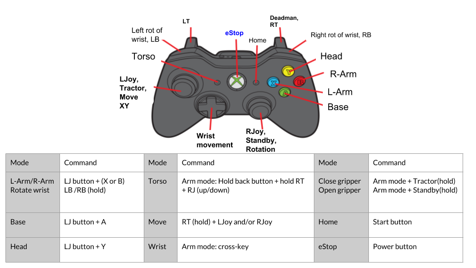

<h1>Movo Xbox teleoperation</h1>

To use the Xbox 360 wireless controller instead of the logitech controller, install the Xbox driver:

`sudo apt-get install xboxdrv`

You should plug a wireless controller receiver in Movo or your computer.


Note that the development computer has to be in the same ROS network.

If you want to control the Movo with a logitech controller or with an Xbox controller, you should go in movo_common/movo_config/movo_config.bash and change 
MOVO_JOY_IS_XBOX or MOVO_JOY_IS_LOGITECH. Put the joystick you want to true and the other to false. Do a `sync_robot -nc`. After this, we suggest you do a `catkin_make` in your movo_ws on Movo2 and Movo1. To do it in movo1 open a shell to Movo 1 and write `cd ~/movo_ws; rm -rf build/ devel/; catkin_make`. Then reboot Movo.


The mapping for the Xbox controller can be found in any of these last two files:




/joy_buttons:

| Index | Button name        | Action                           |
|-------|--------------------|----------------------------------|
| 0     | A                  | Base mode                        |
| 1     | B                  | Right arm mode                   |
| 2     | X                  | Left arm mode                    |
| 3     | Y                  | Head mode                        |
| 4     | LB                 | Wrist control (-)                |
| 5     | RB                 | Wrist control (+)                |
| 6     | back               | Torso control                    |
| 7     | start              | Home arms                        |
| 8     | Power              | eStop                            |
| 9     | Button stick left  | Tractor mode Hold: Open gripper  |
| 10    | Button stick right | Standby mode Hold: Close gripper |

/joy_axis: 
| Index | Axis name                   | Arm mode      | Base mode  | Head mode      | Torso mode |
|-------|-----------------------------|---------------|------------|----------------|------------|
| 0     | Left/Right Axis stick left  | Left/right    | For/Back   | Rot left/right |            |
| 1     | Up/Down Axis stick left     | For/Back      | Left/right |                |            |
| 2     | RT                          | Deadman       | Deadman    | Deadman        | Deadman    |
| 3     | Left/Right Axis stick right |               | Rotate     |                |            |
| 4     | Up/Down Axis stick right    | Up/Down       |            | For/Back       | Up/Down    |
| 5     | LT                          |               |            |                |            |
| 6     | Cross key left/right        | Wrist control |            |                |            |
| 7     | Cross key up/down           | Wrist control |            |                |            |


`
self.ctrl_map  = dict({'momentary': {'MAP_BASE_A'     : {'is_button':True,'index':1,'set_val':1},
                                             'MAP_rARM_B'    : {'is_button':True,'index':2,'set_val':1},
                                             'MAP_lARM_X'      : {'is_button':True,'index':3,'set_val':1},
                                             'MAP_HEAD_Y'      : {'is_button':True,'index':4,'set_val':1},
                                             'MAP_lWRIST_LB'       : {'is_button':True,'index':5,'set_val':1},
                                             'MAP_rWRIST_RB'       : {'is_button':True,'index':6,'set_val':1},
                                             'MAP_TORS_back_'        : {'is_button':True,'index':7,'set_val':1},
                                             'MAP_HOME_start'    : {'is_button':True,'index':8,'set_val':1},
                                             'MAP_eSTOP_power' : {'is_button':True,'index':9,'set_val':1},
                                             'MAP_TRACT_lstick'     : {'is_button':True,'index':10,'set_val':1},
                                             'MAP_stby_rstick': {'is_button':True,'index':11,'set_val':1}},
                               'axis'     : {'MAP_TWIST_LR_stickleft'   : {'index' :1, 'invert_axis':False},
                                             'MAP_TWIST_UD_stickleft'      : {'index' :2, 'invert_axis':False},
                                             'MAP_TRIGGER_LT'        : {'index' :3, 'invert_axis':False},
                                             'MAP_TWIST_LR_stickright'   : {'index' :4, 'invert_axis':False},
                                             'MAP_TWIST_UD_stickright'   : {'index' :5, 'invert_axis':False},
                                             'MAP_TRIGGER_RT'   : {'index' :6, 'invert_axis':False},
                                             'MAP_CROSS_LR'   : {'index' :7, 'invert_axis':False},
                                             'MAP_CROSS_UD'   : {'index' :8, 'invert_axis':False}}})
`
<h2>How to use the Xbox controller</h2>

| Command                                   | Action (while Deadman is triggered)                                                                          |
|-------------------------------------------|--------------------------------------------------------------------------------------------------------------|
| Tractor + A                               | Move in XY and Θ                                                                                             |
| Tractor + X                               |  Activate Left arm mode - Move in XY(leftstick) and Z (right stick up/down) Cross key to control orientation |
| Tractor + B                               | Activate Right arm mode - Move in XY(leftstick) and Z (right stick up/down) Cross key to control orientation |
| Tractor + Y                               | Move head For/Back (rightstick) and rotate Left/Right (LeftStick)                                            |
| Arm mode (When activated) + LB (hold)     | Rotate the gripper clockwise                                                                                 |
| Arm mode (When activated) + RB (hold)     | Rotate the gripper counter-clockwise                                                                         |
| Arm mode (When activated) + Back (hold)   | Move the torso up and down (right stick up/down)                                                             |
| Arm mode (When activated) + Tractor(hold) | Open gripper                                                                                                 |
| Arm mode (When activated) + Standby(hold) | Close gripper                                                                                                |
```
E-Stop:
Press button 9 (Power button) to activate the software E-Stop which will cut power to all torque producing components. Pressing it again will re-enable the actuators in the system and resume normal operation.

Mobile Base:
Press Button 1 (A button) to enable mobile base control. This will allow the user to drive the mobile base around with the joystick but disable control of the arm, linear actuator and pan-tilt 
1. Button 10 (Left Joystick button) puts platform in Standby Mode(no motion commands allowed)
2. Button 11 (Right Joystick button) puts platform in Tractor Mode
3. Axis 6 (Trigger_RT) is dead man switch and must be completely pressed to issue motion commands when in tractor
4. Left_Joystick (Left-Right) axis maps to X velocity
5. Left_Joystick (Up-down) axis maps to Y velocity
6. Right_Joystick (Left-Right) axis is Z rotation velocity

Arms and linear actuator:
Press Button 8(Start button) to home both arms 
Press Button 2 (B button) to enable right arm control (mobile base, pan-tilt and left arm control will be disabled)
Press Button 3 (Y button) to enable left arm control  (mobile base, pan-tilt and right arm control will be disabled)
1. Trigger RT (Axis 6) enables commands and lets you move the arm around (must be completely pressed)
  a. release to hold current position
2. CROSS-Key axis left/right (axis 7) rotates the end-effector around y axis
3. CROSS-Key axis up/down (axis 8) rotates the end-effector around x axis
4. Button 5 (LB button) and 6 (RB button) rotate the end-effector around Z axis
5. Left Joystick Up/down axis maps to x Cartesian velocity of end-effector
6. Left Joystick Left/Right axis maps to y Cartesian velocity of end-effector
7. Right Joystick Up/down axis maps to z Cartesian velocity of end-effector
8. Left Joystick button hold (button 10) - Open gripper
9. Right Joystick button hold (button 11) - Close gripper
10. Back button hold (button 7) + Trigger (Axis 6) and Right Joystick Up/Down to move up or down

Pan-Tilt control:
Press Button 4(Y button)) to enable pan-tilt control (base and arm control will be disabled)
1. Trigger RT (Axis 6) enables commands 
  a. release to hold current position
2. Joystick Left, Up/down axis maps to tilt position
3. Joystick Left, Left/right maps to pan position
```


